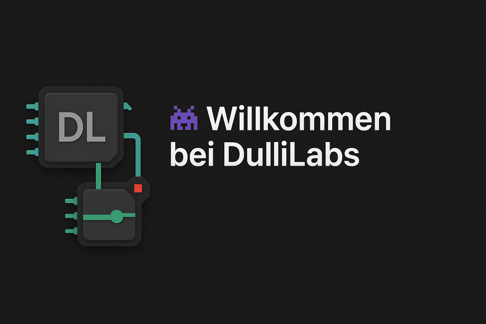

  
  <em>„Technik verstehen heißt, sie zu beherrschen – nicht nur zu benutzen.“</em> 
  <strong>– DulliLabs</strong>

## 🧠 Über mich

- 🎓 Umschüler zum Fachinformatiker für Anwendungsentwicklung  
- ⚙️ Begeistert von Embedded Systems, Webentwicklung & DIY-Tech  
- 📚 Aktuell am Lernen: Angular, Django REST, Firmware & PCB-Spielereien  
- 🧪 Ich liebe es, Hard- und Software in kreativen Projekten zu kombinieren

## 🛠️ Skills & Tools

**Sprachen**  
`Python` `JavaScript` `HTML` `CSS` `C / C++` `C# (Konsolen)` `SQL`

**Frameworks & Werkzeuge**  
`Django + DRF` `Angular (in Arbeit)` `ESP32 / NodeMCU`  
`OrcaSlicer` `Visual Studio / VS Code` `Git / GitHub`

**Tech Stuff**  
`3D-Druck` `SMD-Löten` `Firmware-Analyse` `ESP-Prototyping`

## 🔧 Technisches Profil

- Low-Level bis REST: BIOS, Bootloader, APIs  
- Microcontroller: Sensorik, Displays, WLAN  
- API-Design mit Django REST Framework  
- Firmware Dumping (SPI / CH341A), Analyse, Testing  
- 3D-Druck: Materialien, Slicer, CAD-Prototypen  
- Hardware- und Software-Prototyping

## 🎮 Interessen

- 💡 Mikrocontroller für kreative Probleme
- 🔐 Sicherheit & Interfaces
- 🧱 Konstruktion mit 3D-Druck
- 🌐 Modulare Webentwicklung

## 🚀 Lernziele

- 🧩 Angular + REST API Modularisierung
- 🔍 Firmware-Analyse, Bootsysteme verstehen
- 🤖 Prototypen mit Mikrocontrollern & 3D-Teilen

---

> 📡 Stay tuned – Projekte aus der DulliLabs-Werkstatt folgen regelmäßig!
